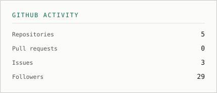
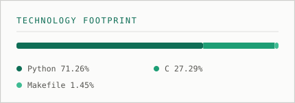

  

### Software Project Manager — medical device software under EU MDR

I came to software through accounting and project management. I'm studying computer
engineering to understand what the teams I manage actually build.

<!-- CARDS:START -->

  
  

<!-- Flip leetcode_enabled to true in profile.yml

  

-->
<!-- CARDS:END -->

---

## Toolstack

<!-- STACK:START -->

| | |
|---|---|
| **Management** | Jira · Azure DevOps · Bitrix24 |
| **Documentation** | Notion |
| **Data** | Excel · SQL · Power BI |
| **Technical** | Git · Figma |
| **Process** | Scrum · Waterfall · Hybrid delivery |

<!-- STACK:END -->

---

## Current work

<!-- BOARD:START -->
| Project | Track | Progress | Current Status |
|---|---|:---:|---|
| [**42 Common Core**](https://github.com/TheVasconcelos/42-Python-CC) | Education | ▰▱▱▱▱▱▱▱▱▱ 12% | Milestone 2 |
| **Computer Engineering** | Education | ▰▰▱▱▱▱▱▱▱▱ 20% | 2nd Semester |
<!-- BOARD:END -->

---

## How to work with me

**Written first.** If a decision isn't in the tracker, it didn't happen. Chat is for
thinking out loud; Jira and Azure DevOps are for what we agreed.

**Hybrid by default.** Iterative where iteration is safe, gated where it isn't.
Regulated work doesn't get to be agile about validation, and that's fine — the two
modes can run side by side if you're deliberate about the seam.

**Traceability isn't bureaucracy.** Under MDR, a requirement with no trace isn't
untidy, it's a finding. I'd rather spend an hour on the link than a week on the audit.

**Early bad news beats late good news.** A slipped date surfaced in week two is a
plan change. The same date surfaced in week six is a problem.

**I ask the obvious question.** I would rather look uninformed for thirty seconds
than sign off on something I don't understand.